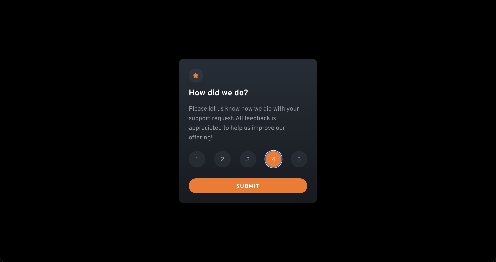

# Interactive rating component with React and Tailwind

This is a solution to the [Interactive rating component challenge on Frontend Mentor](https://www.frontendmentor.io/challenges/interactive-rating-component-koxpeBUmI). 

A simple and clean **React** component for collecting user ratings. It utilizes **Tailwind CSS** to style the interface, providing a great user experience. 

The component uses a functional component structure, using hooks to manage the component state. The component makes use of two sub-components SelectRating and SelectedRating to handle the different states of the component. The styles applied to the component are done with the use of **Tailwind CSS** classes, which makes it easy to customize the look and feel.

## Table of contents

- [Interactive rating component with React and Tailwind](#interactive-rating-component-with-react-and-tailwind)
  - [Table of contents](#table-of-contents)
  - [Overview](#overview)
    - [The challenge](#the-challenge)
    - [Screenshot](#screenshot)
    - [Links](#links)
    - [Run](#run)
  - [My process](#my-process)
    - [Built with](#built-with)
  - [Author](#author)

**Note: Delete this note and update the table of contents based on what sections you keep.**

## Overview

### The challenge

Users should be able to:

- View the optimal layout for the app depending on their device's screen size
- See hover states for all interactive elements on the page
- Select and submit a number rating
- See the "Thank you" card state after submitting a rating

### Screenshot




### Links

- Solution URL: [Add solution URL here](https://your-solution-url.com)
- Live Site URL: [Add live site URL here](https://your-live-site-url.com)

### Run

1. Clone repo
2. Go to project folder ```cd rating-component``` 
3. Instal dependencies `npm i`
4. Run on local machine `npm run dev`

## My process

### Built with

- [React](https://reactjs.org/) - JS library
- [Tailwind](https://tailwindcss.com/) - For styles
- [Vite](https://vitejs.dev/)


## Author

- Website - [Vlad](https://github.com/nic3rafs)
- Frontend Mentor - [@nic3rafs](https://www.frontendmentor.io/profile/nic3rafs)
- Twitter - [@nic3rafs_](https://www.twitter.com/nic3rafs_)
